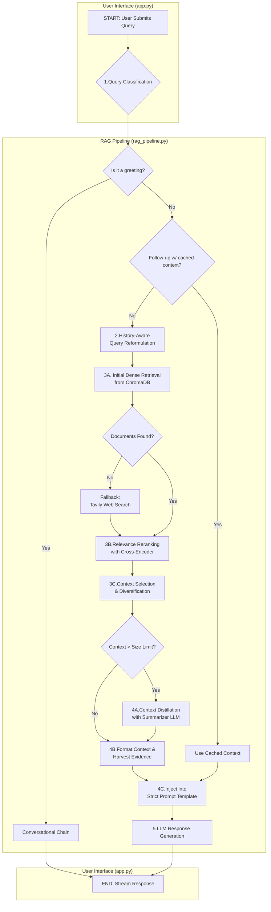

# Final Report: Development and Benchmarking of an Advanced Retrieval-Augmented Generation (RAG) Chatbot for Quantum Computing

**Author:** Mehul Golecha
**Date:** August 21, 2025

---

## Abstract

This report details the end-to-end development, refinement, and evaluation of a Retrieval-Augmented Generation (RAG) chatbot, termed "Quantum Tutor," designed to assist in the study of quantum computing. The project encompasses the construction of a multi-stage RAG pipeline featuring query classification, history-aware reformulation, cross-encoder reranking, and a web-search fallback. A systematic benchmark was conducted to evaluate the generative performance of three Large Language Models (LLMs). Assessment via an LLM-as-a-Judge framework, utilizing `llama-3.3-70b-versatile`, indicated that `openai/gpt-oss-120b` provided the best overall quality, achieving the highest average score across evaluation metrics.

---

## 1. Introduction

### 1.1 Problem Statement

Quantum computing is a complex, rapidly evolving, and highly technical domain. For students, researchers, and professionals, navigating the dense academic literature and technical documentation presents a significant barrier to entry and continuous learning. This project addresses the need for an accessible, accurate, and context-aware AI tutor capable of answering specific, complex questions, minimizing common LLM issues such as hallucination, and providing clear sourcing from a curated knowledge base.

### 1.2 Project Objectives

The project was divided into two primary, interconnected goals:

1.  **System Development:** To build a production-ready, highly resilient RAG chatbot pipeline, complete with a user interface (Streamlit), conversation history, robust retrieval mechanisms, and external tool fallbacks (specifically, web search) for out-of-scope queries.
2.  **Model Benchmarking:** To systematically benchmark and compare the generation quality (faithfulness, correctness, relevancy, etc.) of several high-performance LLMs when integrated into the finalised RAG stack, thereby producing a data-driven recommendation for the optimal primary model.

---

## 2. Methodology & System Architecture

### 2.1 Core Technology Stack

The "Quantum Tutor" relies on a diversified stack designed for robustness and performance:

| Component                       | Technology / Model                                                                           | Function                                                         |
| ------------------------------- | -------------------------------------------------------------------------------------------- | ---------------------------------------------------------------- |
| **Application & Orchestration** | Streamlit, LangChain                                                                         | Frontend UI, pipeline management.                                |
| **LLMs (Primary Test Set)**     | `openai/gpt-oss-120b`, `deepseek-r1-distill-llama-70b`, `qwen/qwen3-32b` (via Groq)    | Final response generation.                                       |
| **LLM (Fallback/Utility)**      | `llama3.1:8b` (Ollama), `gemma2-9b-it` (Summarizer), `llama-3.3-70b-versatile` (Judge) | Local resilience, context distillation, quantitative evaluation. |
| **Vector Store**                | ChromaDB (Collection `quantum_computing_main`)                                               | Document storage and initial retrieval.                          |
| **Embedding Model**             | `BAAI/bge-m3`                                                                                | Semantic representation for retrieval.                           |
| **Reranker Model**              | `BAAI/bge-reranker-large` (Cross-encoder)                                                    | Context relevance fine-tuning.                                   |
| **External Tool**               | Tavily Search API (k=5)                                                                      | Web-search fallback for insufficient local context.              |
| **Database**                    | SQLite                                                                                       | User authentication, chat history persistence.                   |

### 2.2. RAG Pipeline Architecture

The RAG pipeline follows a structured, multi-step process designed to optimise the quality and relevance of the generated responses:

1.  **User Query Submission:** A user submits a query through the Streamlit interface (app.py).
2.  **Query Classification:** An initial LLM-based router classifies the query into one of three categories: `new_topic`, `follow_up`, or `greeting`.
3.  **History-Aware Reformulation:** For `follow_up` queries, the system reformulates the user's input and chat history into a standalone question.
4.  **Hybrid Retrieval:** The standalone question is used to retrieve an initial set of 50 candidate documents (INITIAL_K = 50) from the ChromaDB vector store.
5.  **Cross-Encoder Reranking:** The retrieved documents are re-ranked using `BAAI/bge-reranker-large`, selecting the top RERANK_K = 25 documents based on their relevance score.
6.  **Failure Fallback:** If reranked documents do not meet a quality threshold or no documents are found, the system falls back to a web search using the Tavily Search API.
7.  **Context Processing & Generation:**
    - **Context Distillation:** If the total size of the retrieved context exceeds a character limit, a summarizer LLM (`gemma2-9b-it`) condenses the text.
    - **Prompt Formulation:** The processed context is injected into a strict prompt template that instructs the LLM to answer solely based on the provided information.
    - **Evidence Harvesting:** Verbatim sentences containing keywords from the question are extracted and prepended as an "Evidence" block.
    - **Generation:** The formatted prompt is sent to the selected primary LLM for response generation, with a fallback to a local Ollama model if the primary API fails.
8.  **Response Output:** The generated answer is streamed to the user interface, along with the source documents.
9.  **Caching:** Recent documents are cached for follow-ups questions to reduce re-retrieval.

### 2.3 RAG Pipeline – Process Flow (Text)

This flow outlines the sequence of operations from user query submission to the generation of a final response.

1.  User Query → Classifier determines whether the query is a new topic or a follow-up.
2.  Follow-up? If yes, perform a history-aware rewrite to clarify/contextualize the question before retrieval; otherwise continue.
3.  Retrieve up to INITIAL_K candidates from Chroma (BGE-M3 embeddings); deduplicate candidates.
4.  Rerank with cross-encoder (`BAAI/bge-reranker-large`), threshold ≥ 0.40, keep RERANK_K, then diversify to avoid near-duplicates.
5.  Select TOP_K_TO_LLM passages; if total context exceeds SAFE limit, distill (summarize+compress); else use raw snippets.
6.  Harvest Evidence: extract 2-4 short verbatim quotes to surface key proofs.
7.  Assemble Prompt: Evidence + (Distilled/Raw) context + strict anti-hallucination instructions.
8.  Local context sufficient? If no, trigger Web Fallback (Tavily) to retrieve and format sources; if yes, continue.
9.  Generate & Stream Answer, citing sources with page numbers.
10. Model refusal? If yes and context is available, Force-Answer Retry (benchmark mode) to ensure comparability.
11. Cache & Persist: cache retrieved docs for follow-ups and persist messages + sources in SQLite.

**The Process Flow graph (to view this properly, view this GitHub web version)**

### 2.4 Guardrails and Quality Aids

To ensure high-quality and consistent benchmarking, several guardrails were operationalized:

- **Refusal Override:** In the benchmarking phase, if a model refused to answer a question for which the retrieved context clearly contained the answer, a second pass was triggered to force a RAG response. This ensured fair comparison when the retrieval stack was highly effective.
- **Cheap Recall Metric:** A post-hoc check was implemented to audit the Context Recall metric. If the judge model under-scored recall despite a high sentence-coverage overlap between the answer and the ground-truth context, the metric was adjusted to ensure fairness.
- **JSON Sanitization:** Robust parsers were used to clean invalid JSON output (e.g., trailing commas, escaped quotes) generated by the judge model, ensuring accurate data ingestion.

### 2.5 App & Data Capture

- Streamlit UI with streamed tokens and live latency display; per-message source expanders.
- Auto-title generation for sessions (5-word cap); 👍/👎 feedback sends items to a `review_queue`.
- SQLite persistence: `users`, `chat_sessions`, `chat_messages` (with JSON sources), and `review_queue`.

---

## 3. Benchmarking Framework

A systematic and automated benchmarking framework was implemented to evaluate the performance of different LLMs.

### 3.1. Dataset & Scope

The benchmark utilized a curated test set consisting of 100 unique questions specific to the quantum computing domain. The focus of this evaluation was exclusively on generation quality, which is the most critical metric for an educational application.

- **File:** `benchmark_dataset.jsonl`
- **Size:** 100 questions
- **Avg. question length:** ~75.97 characters (median 76.5)
- **Avg. ground-truth contexts per Q:** 2.05 (range 1-6)
- **Avg. ground-truth answer length:** ~314.6 characters

### 3.2. Procedure

1.  **Answer Generation:** The `benchmark.py` script generated answers for each question in the dataset. The script captured the `final_context`, serialised sources, and `latency_ms` for each item (logged in the answers JSONL), although latency data was not reported due to inconsistencies in the benchmark environment. Optional refusal overrides were used when context overlapped the query.
2.  **Quality Evaluation:** The `evaluate.py` script utilised the `llama-3.3-70b-versatile` model as a judge. A rubric (0-10) was used to score faithfulness, answer relevancy, context precision, context recall, and answer correctness. Robust JSON sanitisation was performed on the judge outputs.

### 3.3. Evaluation Metrics

A custom, automated LLM-as-a-Judge framework was built using the `evaluate.py` script. The powerful `llama-3.3-70b-versatile` model served as the consistent and impartial judge, scoring every answer on a 0-10 scale based on a detailed rubric:

- **Faithfulness:** The accuracy of the answer based on the provided context.
- **Answer Relevancy:** How well the answer addresses the user's specific question.
- **Context Precision:** The signal-to-noise ratio of the retrieved context.
- **Context Recall:** The ability of the retriever to fetch all necessary information.
- **Answer Correctness:** The factual correctness of the answer compared to a ground-truth reference.

### 3.4. Performance Metrics (Scope & Environment)

Latency data was intentionally not reported. Benchmark runs were executed across heterogeneous devices and under unstable network conditions. Reporting end-to-end latency from such a mixed setup would be misleading and non-comparable. To ensure fair, reproducible results, this report focuses on quality metrics only.

---

## 4. Results & Analysis

### 4.1 Quality Evaluation Results (Scores out of 10.00)

The table below summarises the average scores for each of the three tested primary models.

| Model (Primary Generator)       | Faithfulness | Answer Relevancy | Context Precision | Context Recall | Answer Correctness | Avg. Quality |
| ------------------------------- | :----------: | :--------------: | :---------------: | :------------: | :----------------: | :----------: |
| **openai/gpt-oss-120b**         |     8.89     |       9.41       |       8.67        |      8.35      |        8.74        |   **8.81**   |
| **deepseek-r1-distill-llama-70b** |     8.54     |       9.05       |       8.32        |      8.29      |        8.33        |   **8.51**   |
| **qwen/qwen3-32b**              |     8.44     |       9.14       |       8.23        |      8.10      |        8.23        |   **8.43**   |

### 4.2 Discussion

The quantitative results clearly establish the model `openai/gpt-oss-120b` as the definitive winner in terms of generation quality. It secured the highest average score (8.81/10) and led across nearly every individual metric.

The model's superior scores in Answer Relevancy (9.41) and Answer Correctness (8.74) are particularly significant for an educational tutor, demonstrating its ability to accurately synthesise information and tailor the response directly to the user's specific query. Furthermore, this model achieved the highest frequency of "Perfect 10" scores across all metrics, indicating superior top-end consistency.

The high overall scores across all models (8.43 and above) validate the effectiveness of the underlying RAG pipeline components (BGE-M3 embedding and BGE-reranker-large), confirming that the system is consistently providing high-quality context to the generator models. The differences in performance are therefore attributable to the LLM's superior ability to follow complex instructions and synthesize the provided context accurately.

---

## 5. Conclusion & Recommendations

### 5.1. Conclusion

This project successfully developed a robust RAG chatbot for quantum computing, featuring an advanced, multi-stage architecture designed to maximize contextual accuracy and minimize hallucination. The systematic benchmarking provided clear, data-driven evidence supporting the choice of the primary generator model.

Based on the comprehensive quality evaluation, the `openai/gpt-oss-120b` model is the final recommendation for this application due to its commanding lead in producing accurate, faithful, and highly relevant answers. The robust pipeline architecture ensures that this quality remains high even when using slightly lower-scoring models like the DeepSeek and Qwen variants, offering cost/latency trade-off options if necessary.

### 5.2. Recommendations

- **Default primary model:** `openai/gpt-oss-120b` for quality-first configurations.
- **Fallback strategy:** Maintain Ollama `llama3.1:8b` for resilience.
- **RAG settings to keep:** INITIAL_K=50, RERANK_K=25, TOP_K_TO_LLM=3, CHUNK=1800/220.
- **Operationalise guardrails:** Retain refusal overrides for RAG-eligible questions.

---

## 6. Limitations

1.  **No controlled latency baseline:** Speed results were omitted to avoid misinterpretation from heterogeneous hardware and unstable network conditions.
2.  **Judge brittleness:** Any single-judge rubric can mis-score edge cases; we partially mitigate via cheap-recall and refusal flags.
3.  **Context budget trade-offs:** Distillation protects context limits but can slightly lower recall; consider adaptive thresholds.

---

## 7. Future Work

1.  **Standardise speed benchmarking:** Re-run in a fixed environment and capture average/median/p95 latency, logging hardware and network details.
2.  **Ablations:** Sweep RERANK_K, threshold, and chunk size to quantify effects on recall/precision and latency.
3.  **Expand agentic capabilities:** Enhance the query router to allow the chatbot to use external tools.
4.  **Data growth:** Expand the knowledge base and consider parent-document retrieval.
5.  **Judge ensemble:** Add a second judge (tie-breaker) or self-consistency checks on borderline cases.
6.  **Agentic Capabilities:** Expand the current intelligent query router into a fully agentic architecture, enabling the chatbot to use a wider array of external tools (e.g., mathematical solvers, quantum simulators) for multi-step tasks that extend beyond simple retrieval and summarization.
7.  **Human-in-the-Loop Feedback Integration:** Operationalize the collected user feedback (`review_queue` data) by building an administrative interface to curate corrections, thus generating a high-quality, domain-specific dataset for potential model fine-tuning.
