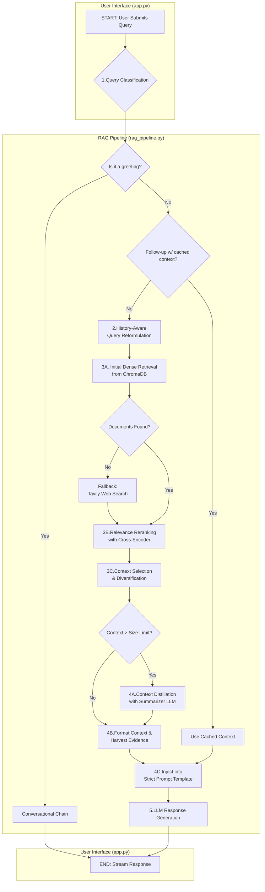

# ⚛️ Quantum Tutor: An Advanced RAG Chatbot


This repository contains the source code for **Quantum Tutor**, a sophisticated Retrieval-Augmented Generation (RAG) chatbot designed as an expert tutor for quantum computing. The system features a multi-stage architecture with intelligent query routing, cross-encoder reranking, web-search fallbacks, and a rigorous, automated benchmarking suite to ensure the highest quality answers.

This project showcases a production-ready application, demonstrating advanced techniques in AI engineering—from data ingestion and vector database management to a resilient, hybrid-LLM strategy and a data-driven evaluation framework.

[**View the Final Report**](./Chatbot_Final_Report/RAG_Chabot_Final_Report.md)

---

## 📋 Table of Contents

1.  [Repository Structure](#-repository-structure)
2.  [Architectural Highlights](#-architectural-highlights)
3.  [Key Features](#-key-features)
4.  [Benchmark Results](#-benchmark-results)
5.  [System Architecture & Tech Stack](#-system-architecture--tech-stack)
6.  [Getting Started](#-getting-started)
7.  [Usage](#-usage)
8.  [Configuration](#️-configuration)

---

## 📁 Repository Structure

The project is organized into distinct modules for clarity and maintainability:

*   **`chatbot/`**: Contains the core application logic, including the Streamlit UI (`app.py`), the RAG pipeline (`rag_pipeline.py`), database handling (`database.py`), and the entire evaluation suite (`benchmark.py`, `evaluate.py`).
*   **`ingestion data/`**: Holds the script (`run_ingestion.py`) responsible for processing source documents and building the vector database.
*   **`data_to_process/`**: The designated folder for placing your raw PDF and Markdown files before they are ingested into the knowledge base.
*   **`benchmarking_data/`**: Contains the question dataset for evaluation (`benchmark_dataset.jsonl`) and is the output directory for generated answers and final evaluation reports.
*   **`Chatbot Final Report/`**: Contains the final project write-up and related assets.

---

## 🎯 Architectural Highlights

The design of Quantum Tutor was guided by three core principles:

*   **Quality-First Retrieval:** The pipeline prioritizes answer quality. Instead of a simple vector search, it employs a **Cross-Encoder reranker** (`BAAI/bge-reranker-large`) to deeply analyze and score document relevance, ensuring the LLM receives only the highest quality context.
*   **Resilience through Fallbacks:** The system is built for high availability. It features an **API-first design** but seamlessly switches to a **local Ollama model** if the API fails. Furthermore, if the internal knowledge base cannot answer a question, it automatically triggers a **web search** using the Tavily API.
*   **Modularity and Control:** The entire system is governed by a central configuration file (`chatbot/config.py`), allowing for easy tuning of every component.

---

## ✨ Key Features

*   **Advanced RAG Pipeline:**
    *   **Intelligent Query Routing:** Classifies user input to direct logic and optimize performance.
    *   **History-Aware Reformulation:** Rewrites questions based on conversational history for better retrieval.
    *   **Cross-Encoder Reranking:** Fine-tunes context relevance before generation.
    *   **Context Distillation:** Automatically summarizes large contexts to prevent errors and improve focus.
*   **Hybrid & Fault-Tolerant System:**
    *   **API-First Design** with a seamless **Local Fallback** to Ollama.
    *   **Web Search Fallback** using the Tavily API for out-of-scope questions.
*   **Professional Evaluation Suite:**
    *   **Automated Benchmarking:** Scripts to run the RAG pipeline over a dataset (`benchmark.py`) and score the results (`evaluate.py`).
    *   **LLM-as-a-Judge:** Uses `llama-3.3-70b-versatile` to provide nuanced scores (0-10) across five critical quality metrics.
    *   **Quality Guardrails:** Implements automated checks to ensure fair and consistent evaluation.
*   **Interactive Streamlit UI:**
    *   User authentication and multi-chat session management.
    *   Real-time answer streaming, automatic conversation titling, and suggested follow-up questions.
    *   A complete user feedback system that flags conversations for review.

---

## 📊 Benchmark Results

A systematic benchmark was conducted to evaluate three primary LLMs on generation quality. Using an LLM-as-a-Judge (`llama-3.3-70b-versatile`), each answer was scored from 0-10 across five metrics.

**Final Quality Evaluation Results (Average Scores out of 10.00)**

| Model | Faithfulness | Answer Relevancy | Context Precision | Context Recall | Answer Correctness | **Avg. Quality** |
| :--- | :---: | :---: | :---: | :---: | :---: | :---: |
| **openai/gpt-oss-120b** | **8.89** | **9.41** | **8.67** | **8.35** | **8.74** | **8.81** |
| deepseek-r1-distill-llama-70b| 8.54 | 9.05 | 8.32 | 8.29 | 8.33 | 8.51 |
| qwen/qwen3-32b | 8.44 | 9.14 | 8.23 | 8.10 | 8.23 | 8.43 |

**Conclusion:** The `openai/gpt-oss-120b` model is the recommended choice, demonstrating superior performance across all quality metrics.

---

## 🛠️ System Architecture & Tech Stack

| Component | Technology / Model | Function |
| :--- | :--- | :--- |
| **Application & Orchestration** | Streamlit, LangChain | Frontend UI, pipeline management. |
| **LLMs (Primary Test Set)** | `openai/gpt-oss-120b`, `deepseek-r1-distill-llama-70b`, `qwen/qwen3-32b` (via Groq) | Final response generation. |
| **LLM (Fallback/Utility)** | `llama3.1:8b` (Ollama), `gemma2-9b-it` (Summarizer), `llama-3.3-70b-versatile` (Judge) | Local resilience, context distillation, quantitative evaluation. |
| **Vector Store** | ChromaDB | Document storage and initial retrieval. |
| **Embedding & Reranking**| `BAAI/bge-m3`, `BAAI/bge-reranker-large` | Semantic retrieval and relevance fine-tuning. |
| **External Tool** | Tavily Search API | Web-search fallback. |
| **Database** | SQLite | User authentication & chat history. |

---

## 🚀 Getting Started

Follow these steps to set up and run the project locally.

### 1. Prerequisites

*   Python 3.11+
*   [Git](https://git-scm.com/)
*   [Ollama](https://ollama.com/) installed and running as a background service.

### 2. Installation

1.  **Clone the repository:**
    ```bash
    git clone https://github.com/your-username/Quantum_Tutor_Chatbot.git
    cd Quantum_Tutor_Chatbot
    ```

2.  **Create and activate a virtual environment:**
    ```bash
    python -m venv .venv
    source .venv/bin/activate  # On Windows: .venv\Scripts\activate
    ```

3.  **Install dependencies:**
    ```bash
    pip install -r requirements.txt
    ```

4.  **Set up API keys:**
    *   Create a file named `.env` in the project root.
    *   Add your API keys for Groq and Tavily.
    ```env
    GROQ_API_KEY="gsk_YourApiKeyHere"
    TAVILY_API_KEY="tvly-YourApiKeyHere"
    ```

5.  **Pull the local LLM for fallback:**
    ```bash
    ollama pull llama3.1:8b
    ```

---

## ▶️ Usage

The project is divided into three main parts. **All commands should be run from the project's root directory.**

#### **Step 1: Ingest Your Data**
First, build the knowledge base for the RAG pipeline.

1.  Place your `.pdf` and `.md` files into the **`data_to_process/`** directory.
2.  Run the ingestion script:
    ```bash
    python "ingestion data/run_ingestion.py"
    ```

#### **Step 2: Run the Streamlit Chatbot**
Launch the user-facing application.

1.  Ensure the Ollama application/service is running in the background.
2.  Run the Streamlit app:
    ```bash
    streamlit run chatbot/app.py
    ```

#### **Step 3: (Optional) Run the Evaluation Benchmark**
This two-phase process evaluates the models on your benchmark dataset.

1.  **Phase 1: Generate Answers** - Runs the pipeline over every question in `benchmarking_data/benchmark_dataset.jsonl`.
    ```bash
    python chatbot/benchmark.py
    # these are for the specific model answer_generation and you can change the main answer model in the config.py file
    # or
    python chatbot/benchmark.py  --dataset ./benchmarking_data/benchmark_dataset.jsonl  --out ./benchmark_data_deepseek_r1_distill_llama_70b/generated_answers.jsonl
    # or
    python chatbot/benchmark.py  --dataset ./benchmarking_data/benchmark_dataset.jsonl  --out ./benchmark_data_openai_gpt_oss_120b/generated_answers.jsonl
    # or
    python chatbot/benchmark.py  --dataset ./benchmarking_data/benchmark_dataset.jsonl  --out ./benchmark_data_qwen_qwen3_32b/generated_answers.jsonl

    ```
2.  **Phase 2: Judge the Answers** - Uses the judge LLM = llama-3.3-70b-versatile to score the generated answers out of 10.
    ```bash
    python chatbot/evaluate.py
    # or
    python chatbot/evaluate.py  --answers ./benchmark_data_deepseek_r1_distill_llama_70b/generated_answers.jsonl  --out ./benchmark_data_deepseek_r1_distill_llama_70b/benchmark_evaluation.csv  --resume --stop_on_tpd
    # or
    python chatbot/evaluate.py  --answers ./benchmark_data_openai_gpt_oss_120b/generated_answers.jsonl  --out ./benchmark_data_openai_gpt_oss_120b/benchmark_evaluation.csv  --resume --stop_on_tpd
    # or
    python chatbot/evaluate.py  --answers ./benchmark_data_qwen_qwen3_32b/generated_answers.jsonl  --out ./benchmark_data_qwen_qwen3_32b/benchmark_evaluation.csv  --resume --stop_on_tpd
    ```
    The final, detailed report will be saved to the path specified in `chatbot/config.py`.

---

## ⚙️ Configuration

The entire project is controlled by the centralized configuration file: **`chatbot/config.py`**. This file allows you to easily tune all aspects of the system, including:

*   **Model Selection:** Change model names for the primary, fallback, summarizer, and judge LLMs.
*   **RAG Hyperparameters:** Adjust `INITIAL_K`, `RERANK_K`, and `TOP_K_TO_LLM`.
*   **Quality Thresholds:** Modify the `RERANKER_SCORE_THRESHOLD`.
*   **Ingestion Settings:** Configure `CHUNK_SIZE` and `CHUNK_OVERLAP`.

## 🧭 RAG Pipeline — Process Flow



This flow outlines the sequence of operations from user query submission to the generation of a final response.

1.  User Query → Classifier determines whether the query is a new topic or a follow-up.
2.  Follow-up? If yes, perform a history-aware rewrite to clarify/contextualize the question before retrieval; otherwise continue.
3.  Retrieve up to INITIAL_K candidates from Chroma (BGE-M3 embeddings); deduplicate candidates.
4.  Rerank with cross-encoder (`BAAI/bge-reranker-large`), threshold ≥ 0.40, keep RERANK_K, then diversify to avoid near-duplicates.
5.  Select TOP_K_TO_LLM passages; if total context exceeds SAFE limit, distill (summarize+compress); else use raw snippets.
6.  Harvest Evidence: extract 2-4 short verbatim quotes to surface key proofs.
7.  Assemble Prompt: Evidence + (Distilled/Raw) context + strict anti-hallucination instructions.
8.  Local context sufficient? If no, trigger Web Fallback (Tavily) to retrieve and format sources; if yes, continue.
9.  Generate & Stream Answer, citing sources with page numbers.
10. Model refusal? If yes and context is available, Force-Answer Retry (benchmark mode) to ensure comparability.
11. Cache & Persist: cache retrieved docs for follow-ups and persist messages + sources in SQLite.

## 🔧 Troubleshooting

-   **`KeyError: GROQ_API_KEY`** → Create `.env` and set keys
    
-   **No retrieval results** → Ensure `./chroma_db` exists (run ingestion) and your docs aren’t empty; verify metadata (source_file/page_number)
    
-   **Ollama not running** → Install & run; `ollama pull llama3.1:8b`
    
-   **Judge 413 / payload too large** → Lower `MAX_CONTEXT_CHARS` or reduce dataset size
    
-   **429/TPD** → Evaluator retries with exponential backoff; use `--resume` for long runs